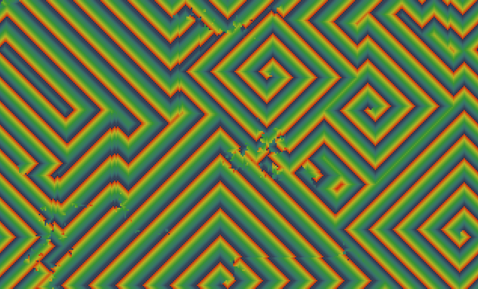
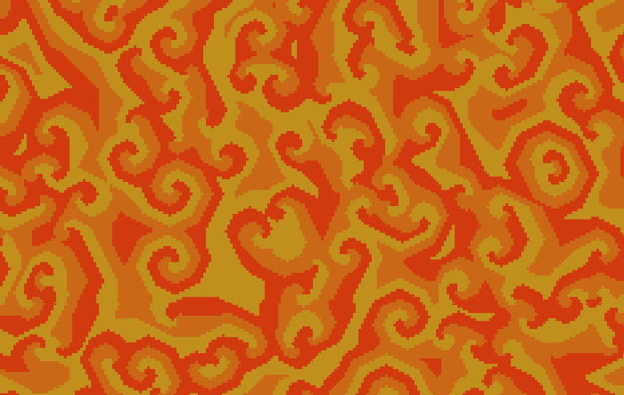
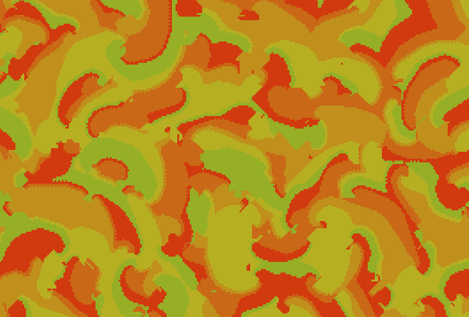
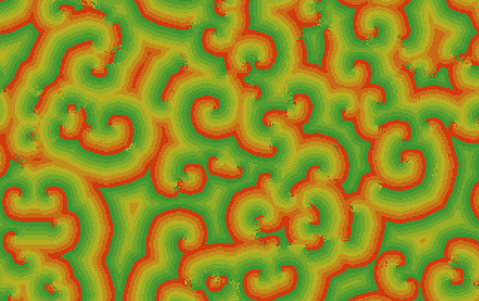

# Generic cyclic 2D cellular automaton

This is an implementation of a generic cyclic 2D cellular automaton.

When the program starts you can enter the rules of the automaton :
- The range
- the threshold (number of next state cells needed in the neighbourhood to upgrade the cell state)
- The number of states
- The type of neighbourhood : Moore or Von-Neumann

Here are some results obtained with different rules : 

Range : 1, Threshold : 1, States : 16, Neghbourhood : Neumann

Range : 1, Threshold : 3, States : 3, Neghbourhood : Moore

Range : 2, Threshold : 4, States : 9, Neghbourhood : Moore

Range : 3, Threshold : 4, States : 5, Neghbourhood : Neumann

Range : 3, Threshold : 5, States : 8, Neghbourhood : Moore

